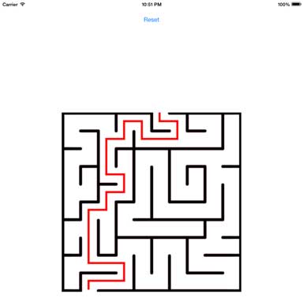

Simple-Maze-Game
================

This is the simple square maze game created with the UIImageView and UIPanGestureRecognizer. 

The implementation is simple and based on the adjancency (left/top/right/bottom) and openness properties between the current cell and next selected cell . 

<small>(Remove *NSMutableIndexSet* if appropriate)</small>

The board is composed of cells indexed from left to right and  top to bottom.
<pre>//Check image above
0 ,  1 ,...., 9
10, 11, ....,19
...
90, 91, ....,99
</pre>

The board is initialized with the cell properties:
<pre>    board = [NSArray arrayWithObjects:
             [NSNumber numberWithInteger:BOTTOM_OPEN|RIGHT_OPEN],
             [NSNumber numberWithInteger:LEFT_OPEN|RIGHT_OPEN],
             ....
</pre> 
user touch position -> cell location
<pre>    indexX = floorf((positioninside.x)/cellWidth);
    indexY = floorf((positioninside.y)/cellHeigh);
    newSelectedIndex = indexX + (indexY*boardNoOfCols);
</pre>
Check that we can move from current index to newly selected index
<pre>              //left
              (newIndex == currentIndex-1 && ([[board objectAtIndex:currentIndex]integerValue] & LEFT_OPEN)) ||
              //bottom
              (newIndex == currentIndex+boardWidth && ([[board objectAtIndex:currentIndex]integerValue] & BOTTOM_OPEN)) ||
              //top
              (newIndex == currentIndex-boardWidth && ([[board objectAtIndex:currentIndex]integerValue] & TOP_OPEN)) ||
              //right
              (newIndex == currentIndex+1 && ([[board objectAtIndex:currentIndex]integerValue] & RIGHT_OPEN))
              )
</pre>
Check winning status
<pre>currentIndex == exitIndex</pre>
Check blocking status *(0-lookahead)*
<pre>    NSInteger curInt = [[board objectAtIndex:currentIndex]integerValue];
    return ((curInt & LEFT_OPEN && ![occupied containsIndex:currentIndex-1]) ||
        (curInt & RIGHT_OPEN && ![occupied containsIndex:currentIndex+1]) ||
        (curInt & TOP_OPEN && ![occupied containsIndex:currentIndex-boardWidth]) ||
        (curInt & BOTTOM_OPEN && ![occupied containsIndex:currentIndex+boardWidth])
        );
</pre>
###Credits
Maze Image - <a href="http://www.bravekidgames.com/p/printables/small/brave_kid_mazes/maze_s_1.png">Link</a>